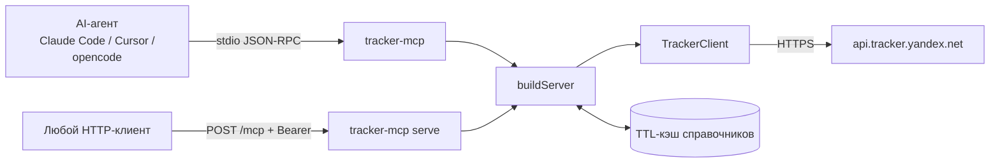
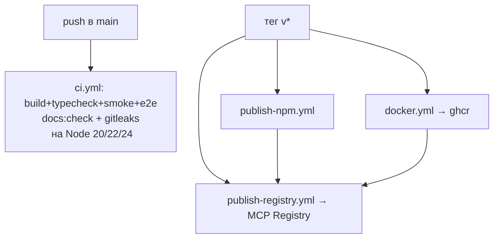

## Карта компонентов

| Компонент | Файл | Ответственность |
|---|---|---|
| **Конфиг** | `src/config.ts` | env: `TRACKER_TOKEN`, `TRACKER_ORG_ID`, `TRACKER_AUTH` (`oauth`/`iam`), `TRACKER_API_URL`, `TRACKER_READ_ONLY`, `TRACKER_CACHE_TTL_MS` |
| **API-клиент** | `src/client.ts` | HTTP-до `api.tracker.yandex.net` / прокси; авторизация; multipart; `If-Match`; версии API (`/v2` для delete-фильтров); разбор 4xx → читаемые ошибки |
| **Кэш** | `src/cache.ts` | TTL-кэш (10 мин) справочников; разделяется инструментами и ресурсами; инвалидируется при админ-записях |
| **Инструменты** | `src/tools/*.ts` (19 модулей) | 187 инструментов по документации API v3 |
| **Ресурсы** | `src/resources.ts` | `tracker://` URI: issue/queue/board/catalog/myself |
| **Промпты** | `src/prompts.ts` | 6 готовых сценариев (standup, weekly-report…) |
| **Фабрика** | `src/server.ts` | `buildServer()`: аннотации readOnly/destructive, режим `TRACKER_READ_ONLY=1` |
| **Точки входа** | `src/index.ts` (stdio), `src/serve.ts` (HTTP) | stdio для агентов, Streamable HTTP на `--port` |
| **CLI** | `bin/tracker-mcp.mjs` | `serve`, `setup`, `update`, `links`, `--version` |
| **Мастер** | `scripts/setup.mjs` | Интерактивная настройка агента |
| **Установщик** | `install.sh` | curl\|bash: Node (nvm) → клон `~/.traker-mcp` → build → мастер |
| **Генератор ссылок** | `scripts/generate-install-links.mjs` | Персональные deeplink-установки в VS Code/Cursor/Claude |
| **Проверки** | `scripts/check-docs-drift.mjs`, `scripts/gen-coverage.mjs`, `scripts/smoke-test.mjs`, `tests/e2e.mjs` | Дрейф доков API 199 страниц, COVERAGE.md, smoke и e2e со стабом API |

## Потоки данных

**Авторизация** (`src/client.ts`): две схемы — OAuth-токен (`y0__…`) с
`X-Org-ID`, либо IAM-токен (`t1.…`, живёт ≤12 часов) с `X-Cloud-Org-ID`.
См. [документацию Яндекса о доступе](https://yandex.ru/support/tracker/ru/api/access).

## Ключевые защиты

| Защита | Где | Что даёт |
|---|---|---|
| **Confirm-гард** | `registerTool`-обёртка в `src/server.ts` | все `delete_*` и `bulk_*` отказывают без `confirm: true` |
| **Read-only mode** | `TRACKER_READ_ONLY=1` | клиент видит только 80 чтений, запись не регистрируется |
| **Аннотации** | каждый инструмент | `readOnlyHint` / `destructiveHint` для UI-подтверждений |
| **Bearer-gate** | `MCP_AUTH_TOKEN` в serve | без него HTTP-эндпоинт биндится только на 127.0.0.1 |
| **Rate-limit бережливость** | документация/скилл | при 429 — пауза 5–10 с и ретрай; e2e не бьёт боевой API |

## Установка и дистрибуция (5+ каналов)

| Канал | Команда | Регистр |
|---|---|---|
| curl\|bash | `install.sh` (GitHub raw) | — |
| npm | `npm i -g tracker-mcp` | npmjs.com (Trusted Publishing OIDC) |
| GitHub Packages | `@sdamarketing/tracker-mcp` | npm.pkg.github.com |
| Docker | `ghcr.io/sdamarketing/tracker-mcp` | ghcr.io |
| Official MCP Registry | `mcp name: io.github.sdamarketing/tracker-mcp` | registry.modelcontextprotocol.io |
| Скилл | `npx skills add sdamarketing/tracker_mcp` | skills.sh |

См. [Установка](/installation.ru) и [Подключение клиентов](/clients.ru).

## CI/CD

